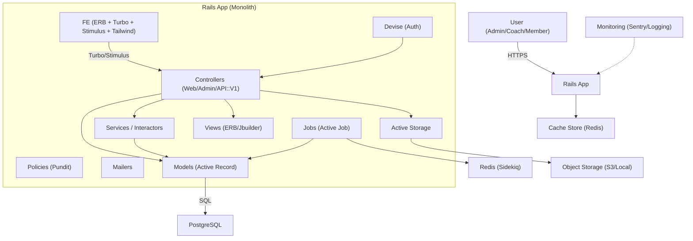

## Swim Manager アーキテクチャ設計書

本書は、Rails + Tailwind CSS + PostgreSQL + Devise + Active Storage を前提とした本システム（Swim Manager）の全体アーキテクチャ、責務分離、ディレクトリ構成、データ・セキュリティ・運用方針を示します。`requirements.md` の要件を満たす形で構成しています。

---

## システム概要と目的
- 水泳チームの選手・コーチ・監督・マネージャーが効率的に運営できる Web アプリケーション。
- Web 画面（一般・管理）と API を同一 Rails モノリス内で提供。
- 認証は Devise、ファイル管理は Active Storage、DB は PostgreSQL、UI は Tailwind CSS + Turbo/Stimulus を採用。

---

## 技術スタック（確定）
- フロントエンド: Rails Views (ERB) + Turbo + Stimulus + Tailwind CSS
- バックエンド: Ruby on Rails（モノリス）
- 認証: Devise（Web は Cookie セッション、API はセッション/トークン拡張）
- データベース: PostgreSQL
- ファイルアップロード: Active Storage（本番 S3、開発 Disk）
- バックグラウンド: Active Job + Sidekiq（Redis）
- キャッシュ: Redis Cache Store
- シリアライゼーション: Jbuilder または ActiveModel::Serializer（API）
- 認可: Pundit（推奨）
- メール: Action Mailer（SendGrid/SES など）
- 監視: Sentry + 構造化ログ（JSON）

---

## システム構成図（論理）


---

## レイヤ別の責務分離
- Controllers（`app/controllers`）
  - Web（`ApplicationController` 配下）: 画面遷移、Turbo/Stimulus 連携、CSRF 保護
  - 管理（`Admin::BaseController` 配下）: RBAC（管理者・コーチ等）、運用系機能
  - API（`Api::V1::BaseController` 配下）: 認証（Devise/CORS）、JSON 出力
- Models（`app/models`）
  - ビジネスルール、整合性（DB 制約 + モデルバリデーション）
- Services（`app/services`）
  - ユースケース/トランザクション/外部 API 呼び出しを集約
- Policies（`app/policies`）
  - Pundit ポリシーでロール/権限を集中管理
- Views（`app/views`）、Frontend JS（`app/javascript/controllers`）
  - ERB + Turbo（部分更新） + Stimulus（UI 振る舞い）
  - Tailwind でユーティリティクラス中心のスタイル
- Jobs（`app/jobs`）
  - メール送信、集計、インポート/エクスポート、画像変換等の非同期処理
- Storage（Active Storage）
  - 直接アップロード、バリアント生成、S3 連携
- Serializers（`app/serializers` または `app/views/**/*.json.jbuilder`）
  - API スキーマの安定化、N+1 対策の明示

---

## ルーティング戦略
- Web（既定スコープ）: 画面用コントローラ
- Admin（`/admin`）: 管理画面専用、認可厳格化
- API（`/api/v1`）: JSON 専用、CORS 対応、バージョニング
- Devise: `users/sign_in`, `users/password` などは `devise_for :users`

例（抜粋）:
```ruby
# config/routes.rb
Rails.application.routes.draw do
  devise_for :users

  root "home#index"

  namespace :admin do
    resources :users
    resources :announcements
    resources :practices
    resources :competitions
    # ほか管理機能...
  end

  namespace :api do
    namespace :v1 do
      resources :members, only: [:index, :show]
      resources :races, only: [:index, :show]
      # ほか API リソース...
    end
  end
end
```

---

## ディレクトリ構成（推奨・本リポジトリ準拠）
本リポジトリの構造に沿いつつ、サービス/ポリシー/シリアライザ等を追加可能な拡張枠を示します。

```
app/
  controllers/
    admin/
      base_controller.rb
      *.rb                         # 管理機能（例: users, practices, competitions ...）
    api/
      v1/
        base_controller.rb
        *.rb                       # 公開 API（例: members, races ...）
    concerns/
    application_controller.rb
  models/
    concerns/
    *.rb
  views/
    layouts/
    shared/
    **/*.html.erb                  # ERB + Turbo
    **/*.json.jbuilder             # API レスポンス（Jbuilder 採用時）
  services/
    users/
      create_user.rb
      import_users.rb
    attachments/
      purge_orphaned_blobs.rb
    # ユースケース単位で整理
  policies/
    application_policy.rb
    *.rb                           # Pundit ポリシー
  serializers/                     # AMS 採用時
    *.rb
  jobs/
    *.rb                           # Active Job（アダプタは Sidekiq）
  mailers/
    *.rb
  helpers/
  javascript/
    controllers/
      *.js                         # Stimulus コントローラ
    application.js                 # Turbo/Stimulus 初期化
  assets/
    stylesheets/
      application.css              # Tailwind エントリ
    tailwind/
      application.css
config/
  environments/
  credentials.yml.enc
  initializers/
    devise.rb
    sidekiq.rb
    active_storage.rb
    content_security_policy.rb
    cors.rb                        # API の CORS 設定（必要時）
    kaminari_config.rb
  routes.rb
  tailwind.config.js
  importmap.rb
db/
  migrate/
  schema.rb
  seeds.rb
lib/
  tasks/                           # Rake タスク
storage/                           # 開発環境の Active Storage ローカル
```

---

## 認証・認可
- 認証（Devise）
  - Web: Cookie セッション（CSRF 有効）
  - API: 同一ドメインであればセッション再利用可。外部クライアント向けにはトークン（`user_auths.authentication_token` を利用）を発行し、`Authorization` ヘッダ等で受け付ける設計に対応。
- 認可（Pundit）
  - `ApplicationPolicy` に基本権限、ドメイン単位の `Policy` で詳細を実装
  - 役割（`player`, `manager`, `coach`, `director`）に応じたアクセス制御

---

## データベース設計指針（PostgreSQL）
- 外部キー・ユニーク・NOT NULL で整合性を DB レベルで担保
- インデックス: 検索キー、外部キー、複合ユニーク、部分インデックスを適用
- マイグレーション: 段階的・安全（NULL 許容→データ移行→NOT NULL）
- 代表テーブル（例）
  - `users`（プロフィール属性、役割、世代、誕生日など）
  - `user_auths`（Devise/メール・パスワード・トークン）
  - `events`（練習/大会）と `attendances`（出欠）
  - `practice_logs`, `practice_times`（練習記録/タイム）
  - `competitions`, `records`, `split_times`（大会記録・スプリット）
  - `objectives`, `milestones`, `milestone_reviews`（目標/マイルストーン）
  - `announcements`（お知らせ）

---

## ファイルアップロード（Active Storage）
- 本番: S3、開発: Disk
- `has_one_attached` / `has_many_attached` をモデルに付与
- 直接アップロード（Direct Upload）/ バリアント生成（画像）
- 大容量処理はジョブ化（Sidekiq）

---

## バックグラウンド・バッチ
- Active Job + Sidekiq（Redis）
  - CSV/Excel 取り込み、集計、メール/通知送信、画像/動画処理、定時バッチ
- 冪等性・再実行性の担保、ジョブ引数は ID 主体、詳細ログ出力

---

## キャッシュ・パフォーマンス
- Redis Cache Store によるフラグメントキャッシュ
- N+1 対策（`includes`/`preload`）、`Bullet` 導入を推奨
- ページネーション（Kaminari）
- キャッシュキー・期限の明確化

---

## エラーハンドリング・監視
- 例外ルーティング: `errors#not_found`, `errors#internal_server_error` など
- 監視: Sentry（リリーストラッキング）、構造化ログ（JSON）
- ヘルスチェック: `/up`（DB/Redis/S3 の疎通は別途ジョブで継続監視）

---

## セキュリティ
- CSP（`config/initializers/content_security_policy.rb`）
- CSRF: Web は有効、API は `null_session` 等を使い分け
- CORS: `config/initializers/cors.rb` で厳格設定（必要時）
- Strong Parameters / パラメータフィルタ
- Devise セキュア設定（パスワード、ロック、リカバリ）

---

## テスト戦略
- RSpec + FactoryBot + Shoulda Matchers
- レイヤ別:
  - モデル（バリデーション・スコープ・関連）
  - サービス（ユースケース）
  - リクエスト（Web/API）
  - システム（E2E、主要動線）
- Active Storage 添付は `fixture_file_upload` を活用

---

## デプロイ/運用
- アプリ: Puma
- 逆プロキシ/配信: Nginx または CloudFront（静的配信/HTTPS 終端）
- CI/CD: Lint/Spec → ビルド → アセットプリコンパイル → デプロイ
- 環境: dev/stg/prod で `credentials` と `storage.yml` を切替
- バックアップ: 日次、RPO/RTO を `requirements.md` に準拠

---

## 要件（requirements.md）との対応
- ユーザー管理/認証（2章）: Devise + RBAC、プロフィール/画像は Active Storage。
- メンバー/予定/出欠（3-5章）: `users`, `events`, `attendances` で実装、管理画面から一括操作・インポート対応。
- 練習記録（6章）: `practice_logs`, `practice_times`、一括タイム入力、分析画面。
- 大会（記録/エントリー）（7-8章）: `competitions`, `records`, `entries`, `split_times`。
- 目標管理（9章）: `objectives`, `milestones`, `milestone_reviews`。
- お知らせ（10章）: `announcements`（公開/非公開/重要度/公開日時）。
- 技術/セキュリティ要件（12章）: Rails 8, PostgreSQL, Devise, Tailwind, Active Storage, REST API, CSRF/XSS/SQLi 対策。
- 運用要件（14章）: パフォーマンス/可用性目標に合わせ、Redis キャッシュ、N+1 対策、Sentry/ログ監視、日次バックアップを運用設計に組込。

---

## 初期セットアップ・チェックリスト
- Devise 導入と `User`/`UserAuth` モデルの設定（API トークンを含む）
- Active Storage 設定（`storage.yml`、本番 S3）
- Tailwind 設定（`tailwind.config.js` / `app/assets/stylesheets/application.css`）
- Sidekiq + Redis（`config/initializers/sidekiq.rb`、管理 UI は管理者限定）
- Pundit 導入（`ApplicationController` に include と rescue 設定）
- Sentry 導入（DSN/環境タグ/リリース）
- CORS 設定（必要時）と CSP 更新
- CI/CD パイプライン整備（Lint/Spec/Build/Deploy）

---

## 付録（運用ガイドの要点）
- マイグレーションは段階的に実施し、DB ロック時間を最小化。
- ジョブは冪等性重視。失敗時リトライと監査ログを残す。
- API はバージョン固定（`/api/v1`）。スキーマ変更は後方互換に配慮。
- キャッシュはキー設計と期限を明文化。無効化手順も明記。
- アクセス制御はポリシー（Pundit）で一元化し、ビュー側での分岐は最小化。

---

最終更新: 2025-08
